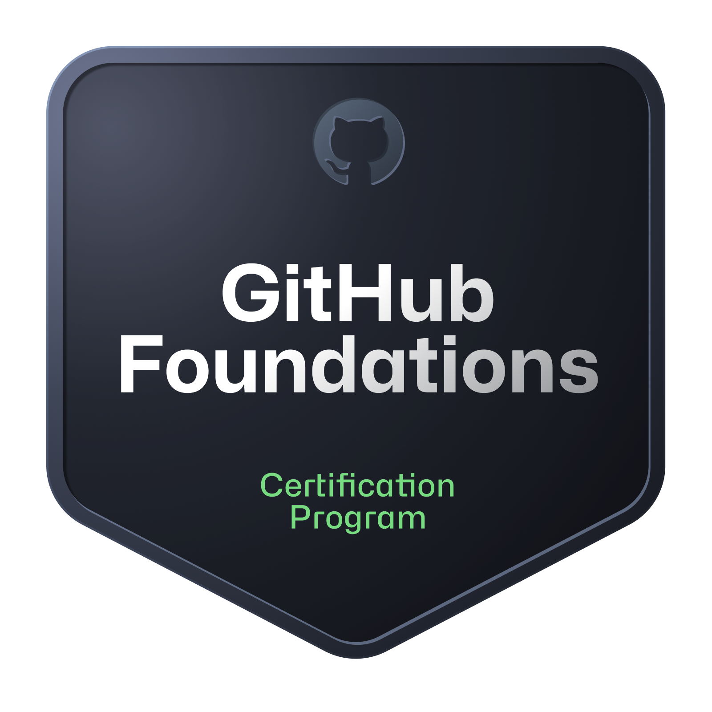
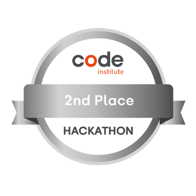
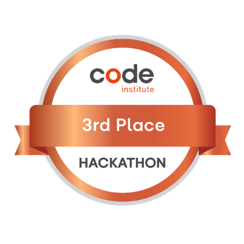

# Hi there, I'm David 👋

I'm a passionate Software Developer with expertise in building full-stack web applications. I love creating seamless user experiences and scalable back-end systems. My goal is to continuously learn and contribute to exciting projects!

## 🔧 Technologies & Tools

## 🏆 GitHub Certification

  
  
<em>GitHub Foundations Certificate</em>

## 🏆 Hackathon Achievement

  
  
<em>2nd Place - Code Institute Elevate Hackathon 2024</em>

  
  
<em>3rd Place - Code Institute ProudCoders Hackathon 2024</em>

## 🚀 Projects

Here are some of the projects I'm currently working on or have contributed to:

- **[StyleSage](https://github.com/trxdave/stylesage)** - A modern web platform for fashion analytics.
- You can find all my repositories [here](https://github.com/trxdave).

## ✨ GitHub Stats

## 🔥 GitHub Streak Stats

## 🏆 GitHub Trophies

## 📊 Most Used Languages

## 📫 How to Reach Me

- 
- 
- 
- 
- 
- 
- 
- 

## 🌱 What I'm currently learning

- Improving my skills in **React.js** and **Node.js**
- Experimenting with **Docker** and **Kubernetes** for DevOps
- Learning **AWS**

## 🌍 Visitors Count

---

⭐️ From [David Cotter](https://github.com/trxdave)
